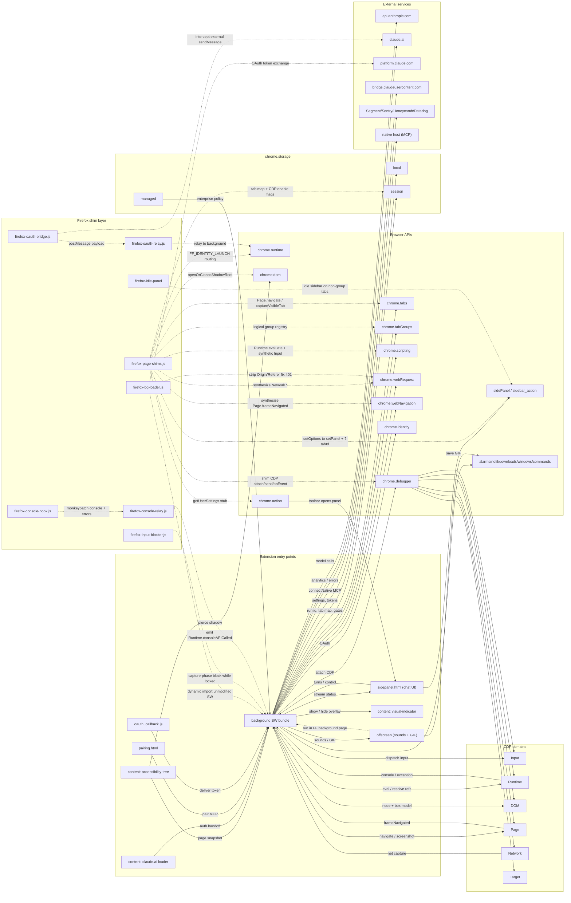

# Extension Port Map — Chrome → Firefox

Comprehensive map of Anthropic's **"Claude"** browser extension (Plasmo-built MV3, v1.0.72) and
its Firefox compatibility port. The repo root **is** the bundled, minified Chrome extension
(`assets/*` — never hand-edited); a layer of root `firefox-*.js` shims + a rewritten `manifest.json`
makes the unmodified Chrome bundle run on Firefox 128+. Source-of-truth detail lives in the two
companion files `docs/_findings_chrome.md` (original feature map) and `docs/_findings_firefox.md`
(port analysis); this document is the synthesis + entity graph.

---

## TL;DR

| Metric | Value |
|---|---|
| Distinct feature areas | 16 |
| ✅ Fully working on Firefox | 11 |
| 🟡 Partial / degraded | 4 (synthetic-input trust, screenshots, shadow DOM, JS dialogs) |
| ❌ Not ported | 1 (native messaging / MCP desktop bridge) |
| Agentic-surface functional coverage | **~90%** |
| chrome.* APIs: native / shimmed / not-ported | 11 native · 6 shimmed · 1 not-ported |
| Biggest remaining feature gap | **Visible native tab groups** (built, but stranded on `origin/firefox-tab-groups`) |
| Branch verdict | `firefox-tab-groups` = unmerged, partially-stale experiment — cherry-pick, don't merge |

---

## 1. Architecture overview

**What it is:** two intertwined products — (1) a **Claude side-panel chat** UI, and (2) **agentic
page automation** where Claude drives arbitrary pages: reads an accessibility-tree snapshot, then
clicks / types / scrolls / navigates and observes results. On Chrome this runs through
`chrome.debugger` (CDP); Claude's working tabs are corralled into a tab group, human input is
locked during a run, and an on-page indicator shows where Claude is acting.

**Entry points:**

| Entry point | File(s) | Role |
|---|---|---|
| Background | `service-worker-loader.js` → `assets/service-worker.ts-*.js` (Chrome SW; FF: `background.scripts`) | The brain — agent loop, CDP session, tabs/groups, native bridge, OAuth, offscreen, storage, telemetry, routing |
| Content: claude.ai loader | `assets/content-script.ts-loader-*.js` | Auth/session handoff + onboarding on `claude.ai` |
| Content: accessibility tree | `assets/accessibility-tree.js-*.js` (`<all_urls>`, all frames, `document_start`) | Serializes page → ref-addressable snapshot the model "sees" |
| Content: visual indicator | `assets/agent-visual-indicator.js-*.js` | On-page "Claude is acting" overlay |
| Side panel | `sidepanel.html` → `assets/index-*.js` | Chat UI (React, markdown, KaTeX, Mermaid) |
| Options / Pairing / Blocked | `options.html` · `pairing.html` · `blocked.html` | Settings · MCP native-bridge pairing · block screen |
| Offscreen | `offscreen.html`/`offscreen.js` + `gif.js`/`gif.worker.js` | Notification sounds + GIF export (DOM tasks the SW can't do) |
| OAuth callback | `oauth_callback.html`/`.js` | Receives OAuth redirect |

**Tech stack:** Plasmo (hashed `assets/*` bundles), React, MV3. i18n (`i18n/*.json`, 11 locales),
managed policy (`managed_schema.json`), telemetry (Segment/Sentry/Honeycomb/Datadog).

**Build difference:** the Chrome manifest uses `background.service_worker`, `side_panel`, and the
`debugger`/`tabGroups`/`sidePanel`/`offscreen` permissions; the Firefox manifest replaces these with
`background.scripts` (shims first), `sidebar_action`, `browser_specific_settings.gecko`, and the
`firefox-*.js` shim layer. `browser-polyfill.min.js` is present but **not loaded** — FF's native
`chrome.*` alias already returns promises for the APIs used.

---

## 2. Full feature inventory

Legend: ✅ done · 🟡 partial · ❌ not ported

| Feature | Chrome implementation | FF status | Notes |
|---|---|---|---|
| Side-panel chat UI | `chrome.sidePanel` + `sidepanel.html` bundle | ✅ | `sidePanel.setOptions`→`sidebarAction.setPanel`; `?tabId` injected before bundle. Can't reopen programmatically (FF needs gesture) → never close, swap content |
| Agentic page automation | `chrome.debugger` CDP loop | ✅ shimmed | `firefox-page-shims.js` translates CDP `sendCommand`/`onEvent` to `scripting`+`tabs`+synthesized events |
| Accessibility-tree snapshot | `accessibility-tree.js` (all frames) | ✅ native | Content script unchanged; runs on FF |
| Agent visual indicator | `agent-visual-indicator.js` | ✅ native | Content script unchanged |
| Synthetic mouse/keyboard | CDP `Input.*` | 🟡 | Synthetic DOM events in MAIN world; `isTrusted=false` — trusted-input-gated elements may ignore |
| Screenshots / GIF frames | CDP `Page.captureScreenshot` | 🟡 | `tabs.captureVisibleTab` — visible tab only, no arbitrary background target |
| Console & error capture | CDP `Runtime.consoleAPICalled`/`exceptionThrown` | ✅ shimmed | `firefox-console-hook.js`(MAIN)→`-relay.js`(ISOLATED)→bg emit; gated on `Runtime.enable` |
| Network capture | CDP `Network.*` | ✅ shimmed | Derived from `webRequest`, gated per-tab via `storage.session` flag |
| Page lifecycle | CDP `Page.frameNavigated` | ✅ shimmed | From `webNavigation.onCommitted` (main frame) |
| Shadow-DOM piercing | `chrome.dom.openOrClosedShadowRoot` | 🟡 shimmed | Native call if present else `el.shadowRoot` (open root only); closed roots often inaccessible |
| Input locking during runs | CDP input interception | ✅ shimmed | `firefox-input-blocker.js` swallows capture-phase trusted events; synthetic agent events pass; Stop stays clickable |
| Tab grouping of working tabs | `chrome.tabGroups`/`tabs.group` | 🟡 shimmed | **main**: logical-only `storage.session` registry (no visible strip group). Visible/native version exists on branch (§6) |
| Notification sounds | offscreen + `notification.mp3` | ✅ shimmed | offscreen.js in FF background page (has DOM); `hasDocument→true` |
| GIF export | offscreen `gif.js`/`gif.worker.js` | ✅ shimmed | Same offscreen-in-background-page mechanism + `downloads` |
| OAuth / identity login | `chrome.identity.launchWebAuthFlow` | ✅ shimmed | oauth-bridge(MAIN)+relay(ISOLATED)→bg token exchange at `platform.claude.com/v1/oauth/token`; sidepanel via `FF_IDENTITY_LAUNCH` |
| CORS 401 on `/v1/messages` | (Chrome SW sends no Origin) | ✅ shimmed | `firefox-bg-loader.js` strips `Origin`/`Referer` for `api.anthropic.com`; injects `anthropic-client-platform`/`-version` |
| Native messaging / MCP bridge | `chrome.runtime.connectNative` | ❌ | No FF native host for `com.anthropic.claude_browser_extension`; degrades gracefully. Needs OS-level host install (not code-only) |
| JS dialog handling | CDP `Page.javascriptDialogOpening` | ❌ | `handleJavaScriptDialog` is a no-op stub; FF can't answer native beforeunload dialogs programmatically |
| Managed policy / i18n / telemetry / keyboard cmd | `storage.managed` · `i18n/*` · `auto-track` · `commands` | ✅ native | All work on FF unchanged |

---

## 3. Browser-API & CDP surface

### chrome.* APIs

| API | Original use | Firefox handling |
|---|---|---|
| `chrome.debugger` | CDP agent driver | ✅ **shimmed** (`firefox-page-shims.js`) — attach/detach/sendCommand/getTargets/onEvent; callbacks fired so bundle's `Promise.race` doesn't stall |
| `chrome.sidePanel` | side panel | ✅ **shimmed** → `sidebar_action` |
| `chrome.identity` | OAuth | ✅ **shimmed** → oauth-bridge/relay + bg token exchange |
| `chrome.dom.openOrClosedShadowRoot` | shadow DOM | 🟡 **shimmed** (open root only) |
| `chrome.action.getUserSettings` | toolbar state | ✅ **shimmed** (stub `{isOnToolbar:true}`) |
| offscreen API | sounds + GIF | ✅ **shimmed** (FF background page) |
| `chrome.tabGroups` / `tabs.group` | group tabs | 🟡 **shimmed** (logical on main; native on branch) |
| `chrome.scripting` | injection (shim substrate) | ✅ native |
| `chrome.tabs` | nav/screenshot/lifecycle | ✅ native |
| `chrome.webNavigation` | lifecycle | ✅ native |
| `chrome.webRequest` / `webRequestBlocking` | header rewrite + Network synthesis | ✅ native |
| `chrome.storage` (local/session/managed) | state + registries | ✅ native |
| `chrome.runtime` (messaging) | message backbone | ✅ native |
| `chrome.alarms`/`notifications`/`downloads`/`windows`/`commands` | misc | ✅ native (no shim — none added speculatively) |
| `chrome.runtime.connectNative` | MCP desktop bridge | ❌ not ported |

### CDP domains/methods (via the debugger shim)

| CDP | Firefox mechanism |
|---|---|
| `Runtime.evaluate` | `scripting.executeScript` MAIN world |
| `Runtime.enable` | flag in `storage.session` (gates console + network capture) |
| `Runtime.consoleAPICalled`/`exceptionThrown` | console-hook→relay→bg emit (gated) |
| `Page.navigate`/`reload` | `tabs.update`/`tabs.reload` |
| `Page.captureScreenshot` | 🟡 `tabs.captureVisibleTab` (visible tab only) |
| `Page.frameNavigated` | `webNavigation.onCommitted` |
| `Page.enable`/`DOM.enable` | no-op |
| `Network.enable`/`*` | per-tab flag + `webRequest`-derived events |
| `Input.dispatchMouseEvent` | 🟡 synthetic mouse in MAIN world (`isTrusted=false`) |
| `Input.dispatchKeyEvent`/`insertText` | 🟡 synthetic; native value setter → React `onChange`; contentEditable `execCommand` |
| `Target.getTargets`/attach | callbacks fired; `tabs`-based |
| `Page.javascriptDialogOpening` (beforeunload) | ❌ not ported |

---

## 4. Firefox port — what's done (per-commit, `main`)

Base `f0b3d62` = Chrome snapshot. Mechanism detail from `03-firefox-port-session.md`.

| Commit | Area | Mechanism |
|---|---|---|
| (CORS) | CORS 401 `/v1/messages` | `firefox-bg-loader.js` strips `Origin`/`Referer` for `api.anthropic.com`; injects client headers |
| (sidebar) | sidePanel → sidebarAction | `setOptions`→`setPanel`; `?tabId` URL injection; no programmatic reopen |
| (CDP cmds) | `chrome.debugger` commands | `sendCommand` switch → synthetic DOM via `scripting` MAIN world; screenshot→`captureVisibleTab`; callbacks fired |
| (CDP events) | `chrome.debugger` events | `webRequest`→`Network.*`; `webNavigation`→`Page.frameNavigated`; via `__ffEmitCdp` + `__FF_CDP_EVENT` broadcast |
| (tab groups) | Tab groups (emulated) | Logical `storage.session` registry; no visible strip group |
| (input lock) | Input lock | `firefox-input-blocker.js` capture-phase swallow of trusted events |
| `31a165e` | Offscreen document | offscreen.js+gif.js in FF background page; `hasDocument→true`. **(merge-base with branch)** |
| `e0bd34f` | Sidebar visibility | Chat only on working-group tabs; idle placeholder elsewhere |
| `fd2d67a` | CDP events + stub | Synthesize `Network.*`/`Page.frameNavigated`; stub `action.getUserSettings` |
| `066e73d` | Console capture | `Runtime.consoleAPICalled`/`exceptionThrown` via console-hook/relay (gated) |
| `6ef057b` | Shadow DOM | Shim `chrome.dom.openOrClosedShadowRoot` |
| `ee20c7e` | Docs | Add `PORTING.md` |
| `cd06fdb` | Sidebar refine | Hide sidebar on non-group tabs while a working group is active |
| `00efd3b` | Docs | Archive scrubbed `docs/context/` (a live OAuth token in local transcripts was redacted) |

---

## 5. Manifest differences (Chrome → Firefox)

| Chrome MV3 | Firefox (main) |
|---|---|
| `background.service_worker` | `background.scripts: [firefox-page-shims.js, gif.js, offscreen.js, firefox-bg-loader.js]` — **shim first is mandatory** (bundle touches Chrome APIs at module-eval) |
| `side_panel` | `sidebar_action.default_panel: "sidepanel.html"` |
| — | `browser_specific_settings.gecko.id="claude-zen@firefox"`, `strict_min_version:"128.0"` |
| permissions incl. `debugger`,`tabGroups`,`sidePanel`,`offscreen` | replaced/shimmed; permission set: `storage, activeTab, scripting, tabs, alarms, notifications, webNavigation, declarativeNetRequest, nativeMessaging, unlimitedStorage, downloads, identity, webRequest, webRequestBlocking` + `<all_urls>` |
| content_scripts (bundle) | 8 entries: oauth-bridge(MAIN), oauth-relay(ISOLATED), bundle content-script, accessibility-tree, agent-visual-indicator, input-blocker(ISOLATED), console-hook(MAIN), console-relay(ISOLATED) |

---

## 6. `main` vs `origin/firefox-tab-groups` branch

- **merge-base `31a165e`** (offscreen commit). `rev-list --left-right --count` = **`7  4`** → main 7 ahead, branch 4 ahead = **true divergence**.
- **Branch-only (4 commits):** native tab groups + chat debug mirror + new-tab URL fix (`a8cea19`), hybrid groups for privileged tabs (`8888f77`), seed main tab into group (`d6659b1`), promote tabs into visible native group (`3d084db`). Implemented by **rewriting** `firefox-page-shims.js` (+730/-…).
- **Main-only (7 commits):** console capture, shadow-DOM shim, `Network.*` synthesis + `getUserSettings` stub, idle/hide sidebar refinements, `PORTING.md`, docs archive.
- **Danger:** the branch **deletes** `firefox-console-hook/relay.js`, `firefox-idle-panel.*`, all docs, and trims `firefox-input-blocker.js` by 13 lines. A straight merge would **regress** console/exception capture, idle/hide sidebar logic, and drop all docs.

**Verdict: unmerged, partially-stale experiment — DO NOT merge directly.** Its sole non-duplicated
value is the **hybrid native/visible tab groups** (native group on FF 139+ for groupable tabs;
`storage.session` negative-id fallback for privileged tabs / FF ≤138; registry stays the access-gate
boundary) plus the **new-tab URL fix** (`chrome://newtab` is illegal in FF). Cherry-pick / re-implement
that onto current main, add the `tabGroups` permission, then retire the branch. The chat debug mirror
(`czDebug()`) is an optional dev aid.

---

## 7. Known limitations

- **Native messaging** — needs an OS-level FF native host for `com.anthropic.claude_browser_extension`; not code-only. Degrades gracefully when absent.
- **JS / beforeunload dialogs** — FF can't answer native dialogs programmatically; `handleJavaScriptDialog` is a no-op stub.
- **Synthetic events untrusted** (`isTrusted=false`) — trusted-input-gated elements may ignore agent clicks/keys. No fix within WebExtensions.
- **`captureVisibleTab` visible-tab-only** — can't screenshot an arbitrary background target.
- **Closed shadow roots** inaccessible in many contexts (open roots work).
- **Tab groups on main are logical-only** — no visible tab-strip group (visible version stranded on branch).
- **Console/Network capture gated** — silent until the agent calls `Runtime.enable`; events before enable are missed.
- **Sidebar can't be reopened programmatically** — FF `open()` needs a user gesture; port swaps content instead.

---

## 8. Remaining / not-yet-ported (prioritized checklist)

**High**
- [ ] Port the branch's **hybrid native/visible tab groups** onto current main (native on FF 139+, `storage.session` fallback for privileged/FF≤138; registry = access-gate). Add `tabGroups` permission. Include the **new-tab URL fix** (unblocks `tabs_create`/`browser_batch`). Retire branch after.
- [ ] **JS dialog / beforeunload handling** — investigate `beforeunload` suppression / `tabs.onUpdated` heuristics so automation doesn't hit a blocking native prompt.

**Medium**
- [ ] **Trusted input events** — at minimum detect/log failures where `isTrusted=false` breaks a site (drag/drop, paste).
- [ ] **Background-tab screenshots** — add activate-then-capture fallback for `Page.captureScreenshot`.
- [ ] **Closed shadow roots** — route shadow/selector queries through the ISOLATED content world (where `openOrClosedShadowRoot` is available) instead of MAIN-world eval.

**Low**
- [ ] **Native messaging** — ship FF native host `.json` + OS registration only if a feature needs the companion.
- [ ] **Screenshot fidelity** — map CDP clip/quality/fromSurface onto `captureVisibleTab`.
- [ ] **Capture-gating UX** — surface that console/network capture is off until `Runtime.enable`.
- [ ] **Optional** — port the opt-in chat debug mirror (`czDebug()`) as a dev aid.

---

## 9. Improvement opportunities

- **Robustness of the CDP shim** — the `sendCommand` switch is the single most fragile surface (callback-vs-promise stalls already bit once). Add a fallback that logs unhandled CDP methods instead of silently no-op'ing, and a self-test that exercises each translated command.
- **Input fidelity** — synthetic `isTrusted=false` is the deepest functional gap. Consider per-action verification (did the click/keystroke take effect via a follow-up snapshot diff) and surface "untrusted-input may have failed" to the model.
- **Single source of truth for tab grouping** — the registry-as-access-gate + native-group-as-cosmetic split (from the branch) is the right design; lock it in so the visible group can never diverge the gate.
- **Shim load-order fragility** — `firefox-page-shims.js` MUST be first; add a runtime assertion that fails loudly if the bundle evaluates before the shim.
- **Test coverage** — there is none. Add a smoke harness (web-ext + a headless FF run) that loads the extension and exercises attach→snapshot→click→screenshot to catch regressions per commit. The repo already mandates `node --check` on edits — extend to a CI lint of all `firefox-*.js`.
- **Drop dead weight** — `browser-polyfill.min.js` is shipped but unused; remove or document why it's retained.
- **Capture coverage** — console/network gating silently drops pre-`enable` events; consider a short ring buffer so the first events after attach aren't lost.
- **MV2/MV3 & FF version matrix** — document the FF 128 (emulated) vs 139+ (native groups) behavior matrix explicitly; feature-detect rather than version-gate where possible.

---

## 10. Entity relationship graph

### Legend — Firefox shim → Chrome capability replaced

| Shim node | Replaces / emulates | Mechanism |
|---|---|---|
| `firefox-page-shims.js` | `chrome.debugger` (CDP), `sidePanel`, `chrome.dom`, `action.getUserSettings`, `tabGroups` | CDP `sendCommand`/`onEvent` → `scripting`+`tabs`+synthesized events; sidebar bridge; shadow-DOM + stub; `storage.session` group registry |
| `firefox-bg-loader.js` | (FF-only) CORS fix + `chrome.identity` token exchange | blocking `webRequest.onBeforeSendHeaders` Origin strip; OAuth exchange at `platform.claude.com`; `import()`s SW bundle |
| `firefox-oauth-bridge.js` / `-relay.js` | `chrome.identity.launchWebAuthFlow` | MAIN-world intercept of claude.ai external `sendMessage` → ISOLATED relay → background |
| `firefox-input-blocker.js` | CDP input interception + `chrome.dom` (content world) | capture-phase swallow of trusted events while locked |
| `firefox-console-hook.js` / `-relay.js` | CDP `Runtime.consoleAPICalled`/`exceptionThrown` | MAIN console monkeypatch → ISOLATED relay → background emit (gated) |
| `firefox-idle-panel.*` | (FF sidebar is global, not per-tab) | placeholder panel shown on non-working tabs |
| `offscreen.js` (in background page) | `chrome.offscreen` document | FF background page has a DOM → runs sounds + `gif.js` there; `hasDocument→true` |

---

*Companion detail: `docs/_findings_chrome.md` (original feature map, 50+ entity edges) · `docs/_findings_firefox.md` (per-commit log, full API/CDP coverage tables, branch analysis).*
